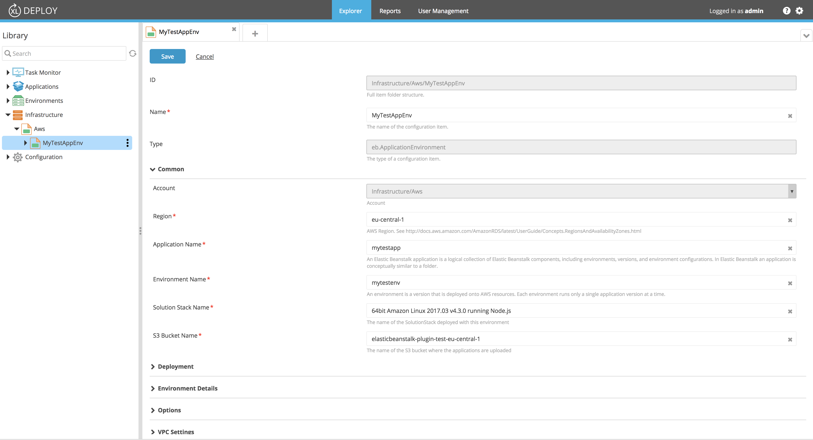
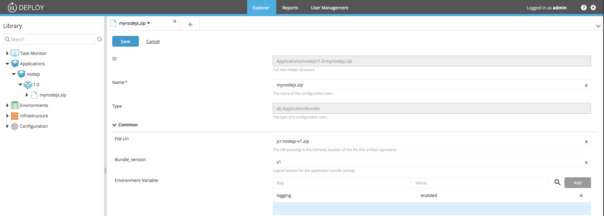

# XLD AWS Elastic Beanstalk Plugin

[](https://opensource.org/licenses/MIT)
[](https://travis-ci.org/xebialabs-community/xld-elasticbeanstalk-plugin)
[](https://www.codacy.com/app/ravan/xld-elasticbeanstalk-plugin?utm_source=github.com&amp;utm_medium=referral&amp;utm_content=xebialabs-community/xld-elasticbeanstalk-plugin&amp;utm_campaign=Badge_Grade)

## Overview
This plugin enables AWS Elastic Beanstalk deployments from XL Deploy.

## Requirements ##

* XL Deploy Server 7+
* XL Deploy AWS plugin

## Installation

Copy the plugin JAR file into the `SERVER_HOME/plugins` directory of XL Deploy.

# Usage

## ElasticBeanstalk Application Environment

Define the information about the ElasticBeanstalk application environment,  ___eb.ApplicationEnvironment___, as a child of an ___aws.Cloud___ configuration item under the ___Infrastructure___ node.



## ElasticBeanstalk Application Bundle

Define the ElasticBeanstalk application bundle, ___eb.AppicationBundle___ in a ___udm.DeploymentPackage___.



## Development ##

### Setting up AWS credentials ###

Create an `itest-conf.json` file in this projects root folder defining the following content with that for your AWS account.

```
[ {
    "name": "aws_cloud",
    "accesskey": "xxxxxxxxx",
    "accessSecret": "xxxxxxxxx"
  }
]

```

The plugin's Jython Tests will use this file to connect to the AWS account and run the integration tests.

### Setting up a local Jython interpreter and dependent librariers to run tests ###

Install Jython on your local system by using the [Jython 2.7.1 Installer](http://central.maven.org/maven2/org/python/jython-installer/2.7.1/jython-installer-2.7.1.jar)

Use ___pip___ located in the Jython installation's `bin` directory to install the `boto3` library.

`pip install boto3`

### Setting up Gradle for Jython tests ###

Create an `gradle.properties` in this project's root folder defining the following content making adjustments for your Jython installation.

```
jythonInterpreter=/Users/ravan/labs/software/jython-2.7.1/bin/jython
```

Your Jython tests should be written with the [Python 2 Unit testing framework](https://docs.python.org/2/library/unittest.html) and the file name should match the pattern `*_test.py`

### Running Tests from Gradle ###

From the project root, 

* Run all tests with `./gradlew clean build itest` 

* Run a single test with `./gradlew runTest -DtestName=itests.connection_test.CheckConnectionTest`

	The `testName` parameter is the absolute reference to the test class.
	
### Running Tests from IDE ###

You can also run and debug tests from Intellij using a __python test__ configuration similar to the one below.


	

---

